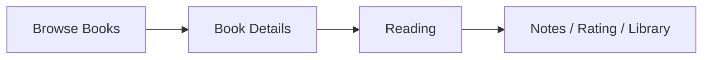
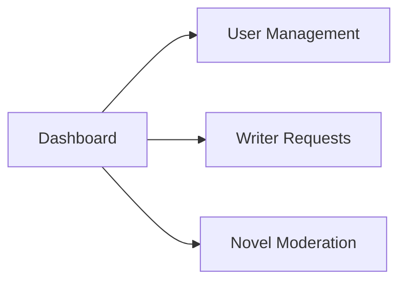
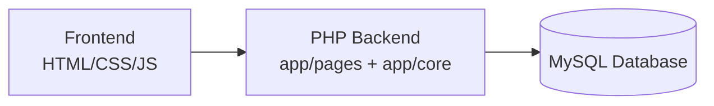

<div align="center">

<!-- NOTE: filename contains a space ("sarrdd Logo.png") — consider renaming to "sard-logo.png" to avoid rendering issues on GitHub -->


# Sard (سرد)

**An Arabic digital reading and publishing platform.**

*Discover. Read. Write. Publish — in Arabic.*


</div>

---

## Table of Contents

- [Overview](#overview)
- [Features](#features)
- [Screenshots](#screenshots)
- [User Flows](#user-flows)
- [Core Features](#core-features)
- [Technical Architecture](#technical-architecture)
- [Tech Stack](#tech-stack)
- [Database](#database)
- [Project Structure](#project-structure)
- [Installation](#installation)
- [Authentication & Authorization](#authentication--authorization)
- [Future Improvements](#future-improvements)
- [Project Information](#project-information)

---

## Overview

**Sard (سرد)** is a role-based web platform built for Arabic reading culture. It brings readers, writers, and administrators together in one place: readers discover and read Arabic books, writers publish and manage their own novels through a moderated workflow, and admins oversee users and content before it goes live.

The platform is a full-stack PHP + MySQL application with server-rendered pages, session-based authentication, and role-based access control.

---

## Features

<table>
<tr>
<td valign="top" width="33%">

### 📖 Reader
- Browse & search books
- Filter by category
- Chapter-based reading (RTL)
- Ratings & comments
- Personal library (favorites, reading now, completed)
- Reading notes
- Profile management

</td>
<td valign="top" width="33%">

### ✍️ Writer
- Apply for writer access
- Writer dashboard
- Create & manage novels
- Chapter drafts & publishing
- Track novel status

</td>
<td valign="top" width="33%">

### 🛡️ Admin
- Admin dashboard & metrics
- Approve/reject writer requests
- Moderate novel submissions
- Manage user roles
- Manage own profile

</td>
</tr>
</table>

---

## Screenshots

<!-- IMAGE: Home Page screenshot goes here -->


<details>
<summary><strong>View more screenshots</strong></summary>

<br>

<table>
<tr>
<td width="50%">

**Browse Books**
<!-- IMAGE: Browse Books screenshot goes here -->


</td>
<td width="50%">

**Book Details**
<!-- IMAGE: Book Details screenshot goes here -->


</td>
</tr>
<tr>
<td width="50%">

**Reading Experience**
<!-- IMAGE: Reading page screenshot goes here -->


</td>
<td width="50%">

**Profile / Library**
<!-- IMAGE: Profile page screenshot goes here -->


</td>
</tr>
<tr>
<td width="50%">

**Writer Dashboard**
<!-- IMAGE: Writer dashboard screenshot goes here -->


</td>
<td width="50%">

**Admin Dashboard**
<!-- IMAGE: Admin dashboard screenshot goes here -->


</td>
</tr>
</table>

</details>

---

## User Flows



<details>
<summary><strong>View Writer & Admin flows</strong></summary>

**Writer Flow**


**Admin Flow**


</details>

---

## Core Features

- **Book Discovery** — keyword search across title, author, description, and keywords, with category filtering
- **Chapter-Based Reading** — RTL Arabic reading layout with chapter navigation, progress tracking, and long-chapter pagination
- **Ratings & Comments** — one rating per user with automatic average recalculation; comment threads per book
- **Personal Library** — favorites, "reading now," "my list," and "completed" tracking per user
- **Notes** — CRUD notes tied to a novel (and optionally a chapter/page) while reading
- **Writer Workflow** — application → admin approval → novel creation → admin moderation → publication
- **Admin Moderation** — writer request review, novel approval/rejection, and role management
- **Authentication & Roles** — session-based login with `user`, `writer`, and `admin` roles

---

## Technical Architecture



The application follows a simple front-controller pattern: `public/index.php` routes requests to page files under `app/pages/`, with shared logic (session handling, DB connection, helpers) in `app/core/`. Data access uses **PDO** with prepared statements, sessions manage the logged-in user, and role checks (`$_SESSION['user']['role']`) gate access to protected pages.

---

## Tech Stack

| Layer | Technology |
|---|---|
| Frontend | HTML5, CSS3, JavaScript |
| Backend | PHP |
| Database | MySQL (via PDO) |
| Local Environment | XAMPP (Apache + MySQL + phpMyAdmin) |
| Version Control | Git |

---

## Database

The app connects to a MySQL database named `nti_sard`. Since no SQL schema file is committed to the repo, the structure below is inferred from the application's queries.

<details>
<summary><strong>View Database Details</strong></summary>

**Main tables:**

- `users` — accounts, roles, profile data
- `writer_requests` — writer applications and status
- `authors` — author profiles linked to novels
- `categories` — book categories
- `publishers` — publisher metadata
- `novels` — main book records
- `homepage_books` — homepage shelf layout
- `novel_categories` — many-to-many novel/category assignment
- `chapters` — chapter records per novel
- `comments` — user comments on books
- `book_ratings` — user ratings and average calculation
- `user_library` — favorites and reading status
- `notes` — user reading notes

**Key relationships:**

- `authors.id` → `novels.author_id`
- `categories.id` → `novels.category_id`
- `users.id` → `writer_requests.user_id`, `comments.user_id`, `book_ratings.user_id`, `user_library.user_id`
- `novels.id` → `chapters.novel_id`, `notes.novel_id`

</details>

---

## Project Structure

```
Sard/
├── public/
│   ├── index.php              # Front controller
│   └── assets/
│       ├── css/                # Stylesheets
│       ├── js/                 # Client-side scripts
│       └── images/             # Covers, avatars, uploads
├── app/
│   ├── core/                   # DB config, session init, helpers
│   └── pages/                  # Main application pages
├── Design/                     # Early design/demo files
└── FINAL_PROJECT_DOCUMENT.md   # Project documentation
```

---

## Installation

1. **Place the project** inside your XAMPP web root, e.g. `C:\xampp\htdocs\NTI_Project`
2. **Start Apache and MySQL** from the XAMPP Control Panel
3. **Create the database** in phpMyAdmin, named `nti_sard` (no SQL dump is included — tables must be created according to the queries used in `app/pages/` and `app/core/`)
4. **Check the config** in `app/core/config.php`:
   ```
   DBHOST = localhost
   DBNAME = nti_sard
   DBUSER = root
   DBPASS = (empty)
   ```
5. **Run the app** by visiting:
   ```
   http://localhost/NTI_Project/public/
   ```

> **Note:** No demo/test credentials are included — register a new account through the signup page. Admin and writer roles are granted through the application workflow.

---

## Authentication & Authorization

Authentication uses PHP sessions and MySQL-backed user records. On login, credentials are checked against the `users` table with `password_verify()`, and role/profile data is stored in `$_SESSION['user']`.

<details>
<summary><strong>View implementation details</strong></summary>

- Session setup lives in `app/core/init.php` (`session_start()`), refreshed from the database on each request
- Signup inserts a new row into `users` with `username`, `email`, and a hashed password
- Authorization is enforced by checking `$_SESSION['user']['role']` before granting access to protected pages, e.g.:
  - Admin-only: `app/pages/admin.php`
  - Writer-only: `app/pages/author_dashboard.php`
  - Writer or Admin: `app/pages/add_novel.php`
  - Logged-in users only: profile and notes pages
- Roles: `user`, `writer`, `admin`
- Writer application status is tracked via `writer_request_status` / `writer_requests`

</details>

---

## Future Improvements

- Stronger validation and moderation rules for submissions
- Richer author profiles and advanced search filters
- Email verification and password reset flow
- More detailed reading analytics
- Chapter comments and reading highlights
- API-based mobile app integration
- Committed SQL schema/migration file

---

## Project Information

| | |
|---|---|
| **Project** | Sard (سرد) |
| **Type** | Full-stack Arabic reading & publishing platform |
| **Stack** | PHP + MySQL |
| **Environment** | XAMPP (local development) |
| **Status** | University project |
